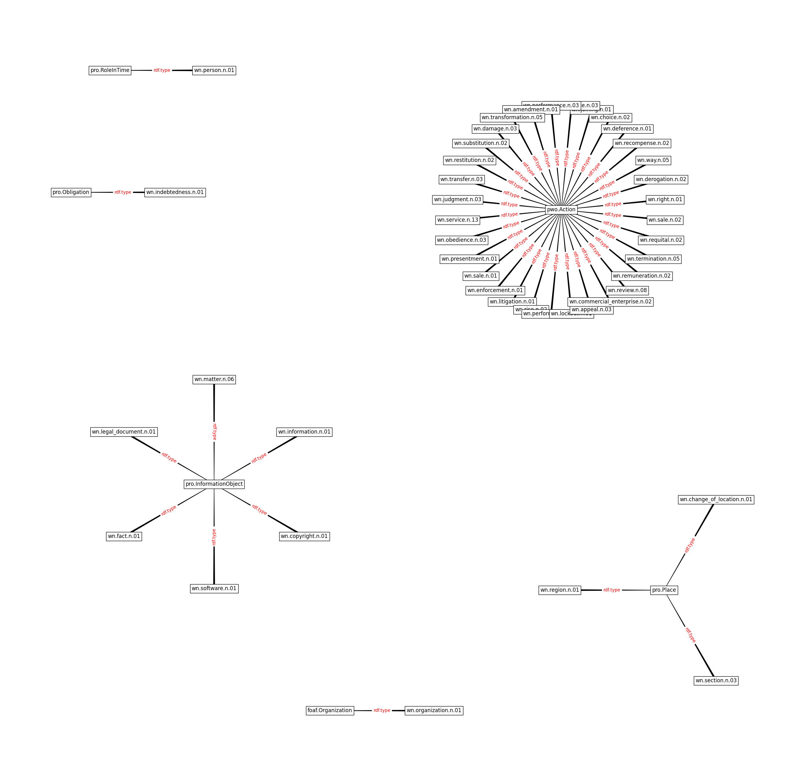

Legal Knowledge Extraction for Knowledge Graph Based Question-Answering
==========

Extra documentation (knowledge graph, images, etc..) of the paper "Legal Knowledge Extraction for Knowledge Graph Based Question-Answering".

## Usage and Installation
This project has been tested on Debian 9 and macOS Mojave 10.14 with Python 3.7.9. 
The [web_app](web_app) folder contains the code of the answer retriever. The [web_app/setup.sh](web_app/setup.sh) script to installs the software. To run the web app, execute the following command ```./web_app/server.sh port_num``` where port_num is the number of the port. After running the "server.sh" script, you can access the web app through your browser at http://localhost:port_num (remember to replace the string port_num with the correct port number you have chosen).

**N.B.** Before being able to run the setup.sh scripts you have to install: virtualenv, python3-dev, python3-pip and make. 

## Files

* [The whole Knowledge Graph in graphml format](graph.graphml)
* [The Taxonomy within the Knowledge Graph](kg_taxonomy)
* [The ontological hinge obtained by aligning the Ontology Design Patterns to the Taxonomy](kg_hinge)

## Sources

The Knowledge Graph has been extracted from:
* [Rome I Regulation EC 593/2008](https://eur-lex.europa.eu/legal-content/EN/TXT/PDF/?uri=CELEX:32008R0593&from=EN)
* [Rome II Regulation EC 864/2007](https://eur-lex.europa.eu/legal-content/EN/TXT/PDF/?uri=CELEX:32007R0864&from=EN)
* [Brussels I bis Regulation EU 1215/2012](https://eur-lex.europa.eu/legal-content/EN/TXT/PDF/?uri=CELEX:32012R1215&from=EN)

## KG's Taxonomy


## Taxonomical Hinge


## Contact

To report issues, use GitHub Issues. 
For other queries, contact Francesco Sovrano: 
* <francesco.sovrano2@unibo.it>
* <cesco.sovrano@gmail.com>